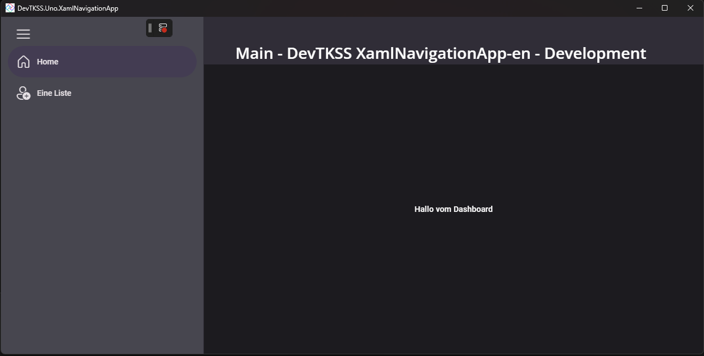

# DevTKSS Uno Samples

Welcome to this Samples Repository! ❤️

The samples in this Repository are meant to help other Developers, independent to their pre-knowledge, get an Idea of how to use the shown things.

> [!TIP]
> Check out the [Documentation](./doc/articles/introduction.md), for more a more detailed List and future coming Guides and Explanations.

## Table of Contents

- [DevTKSS Uno Samples](#devtkss-uno-samples)
  - [Table of Contents](#table-of-contents)
  - [Mvux Gallery](#mvux-gallery)
    - [Controls to be explored in this App](#controls-to-be-explored-in-this-app)
    - [Uno.Extensions to be explored here](#unoextensions-to-be-explored-here)
    - [Known Issues](#known-issues)
  - [Tutorials](#tutorials)
    - [German Language](#german-language) 
  - [Help Welcome!](#help-welcome)
  - [See also](#see-also)

## Mvux Gallery

Following list provides you a quick Overview, what you can find in the [Mvux Gallery](./src/DevTKSS.Uno.Samples/DevTKSS.Uno.Samples.MvuxGallery) App.
The depending Documentation you can find [here](./doc/articles/MvuxGallery/Overview.md)

### Controls to be explored in this App

- FeedView combined with:
  - GridView
  - ListView
- DataTemplate centralized Resource definition
- Card
- Grid
- NavigationView
- `ItemOverlayTemplate` DataTemplate layout replicated from WinUI 3 Gallery
- TabBar & TabBarItem

### Uno.Extensions to be explored here

- Mvux
  - ListFeed
  - State
- Navigation
  - via Xaml
- Hosting
- DependencyInjection
- Serialization
  - JsonSerializerContext of each DataModel
  - Using multiple `JsonSerializable(typeof...)` Attributes to extend the `CodeSampleOptionsContext.Default.<...>` Items
- Configuration
  - Data for Serialization load from separate `appsettings.sampledata.json`
- Storage
  - Directly in the Model Definition
  - Via Service
  - Via StorageExtension
    - Referenced currently in private preview package
  - Via Uno.Extensions.Storage.IStorage Interface extension
    - added as PR to Uno.Extensions [#2734](https://github.com/unoplatform/uno.extensions/pull/2734)
- Localization
  - **IStringLocalizer**
    - Resources Dictionaries
    - Binding current value in `IState<string>` and to corresponding View
    - Requesting localized Items via FeedView
  - **ILocalizationService**
    - Requesting current culture

### Known Issues

- [ ] Fixing ThemeResource Styled that are not seeming to listen to Theme changes
- [ ] Getting `IOptions` with JsonTypeInfo Typed to Dictionary or Tuples does not work as expected and only returns null values. (see [#6](./issues/6))
- [ ] Missing Information about how to use `NamedOptions` at the point they should get retuned by the IConfiguration to Configure the Service because Uno did remove the Microsoft own `.Configure<...>` which would be known, but is missing a documentation about those Changes applyed. So in amiss of that, we need to create a derrived Record for each of them to get the correct JsonSerializable Type and makes us need to define the CodeSampleService Generic.

## Tutorials

### German Language

- **Xaml Navigation with NavigationView**
  - [ ] Video Tutorial (*pending release*)
  - [Documentation in German Language](./doc/articles/MvuxGallery/How-To-XamlNavigation.md)

  Here is a sneak peak of the end Result of the Xaml Navigation Tutorial you can explore 😍

  

  Source Code already available in the [DevTKSS.Uno.XamlNavigationApp](./src/DevTKSS.Uno.XamlNavigationApp-1/) Project.
<!--markdownlint-disable MD026 -->
## Help Welcome!

If you want to help out, please feel free to open an [issue](./issues) or PR.

Every helping hand is welcome and I will try to review and merge it as soon as possible.

## See also

- [Uno Platform](https://platform.uno/)
  - [Documentation Intro](https://platform.uno/docs/articles/intro.html)
  - [Uno Navigation Extensions](https://platform.uno/docs/articles/external/uno.extensions/doc/Learn/Navigation/NavigationOverview.html)
  - [Mvux Documentation](https://platform.uno/docs/articles/external/uno.extensions/doc/Learn/Mvux/Overview.html)
  - [FeedView Control](https://platform.uno/docs/articles/external/uno.extensions/doc/Learn/Mvux/FeedView.html)
