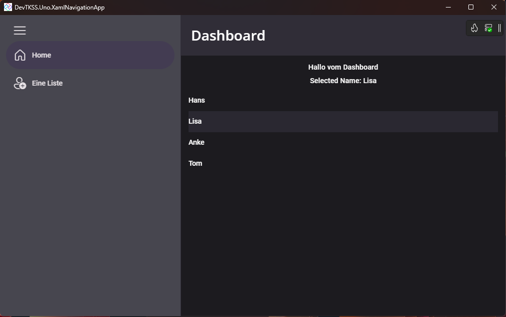

# DevTKSS Uno Samples

Welcome to this Samples Repository! ❤️

The samples in this Repository are meant to help other Developers, independent to their pre-knowledge, get an Idea of how to use the shown things.

> [!TIP]
> Check out the [Documentation](./doc/articles/introduction.md), for more a more detailed List and future coming Guides and Explanations.

**Table of Contents** *(of this ReadMe)**

- Samples in this Repository:
  - [Mvux Gallery](#mvux-gallery)
    - [Sampled Controls](#sampled-controls)
    - [Uno.Extensions](#sampled-unoextensions)
    - [Known Issues](#known-issues)
  - [Mvux.XamlNavigationApp](./src/DevTKSS.Uno.XamlNavigationApp-1/)
  - [Tutorials](#tutorial-videos-and-used-samples)
    - [Mvux XamlNavigation App](#mvuxxamlnavigationapp)

Last but not least:

- [Contributions Welcome!](#help-welcome)
- [See also](#see-also)

## Mvux Gallery

**Wanna see a quick showcase, what to explore there?**

Following list provides you a quick Overview, what you can find in the [Mvux Gallery](./src/DevTKSS.Uno.Samples/DevTKSS.Uno.Samples.MvuxGallery) App.
[Detailed and linked Overview about the Mvux Gallery Contents](./doc/articles/MvuxGallery-Overview.md)

### Sampled Controls

- FeedView combined with:
  - GridView
  - ListView
- DataTemplate centralized Resource definition
- Card
- Grid
- NavigationView
- `ItemOverlayTemplate` DataTemplate layout replicated from WinUI 3 Gallery
- TabBar & TabBarItem

### Sampled Uno.Extensions

- Mvux
- Navigation
  - via Xaml
- Hosting (App Host Builder)
- Dependency Injection
- Serialization
- Configuration
  - Data for Serialization load from separate `appsettings.sampledata.json`
- Storage
- Localization

### Known Issues

- [ ] Fixing ThemeResource Styled that are not seeming to listen to Theme changes
- [ ] Getting `IOptions` with JsonTypeInfo Typed to Dictionary or Tuples does not work as expected and only returns null values. (see [#6](./issues/6))
- [ ] Missing Information about how to use `NamedOptions` at the point they should get returned by the IConfiguration to Configure the Service because Uno did remove the Microsoft own `.Configure<...>` which would be known, but is missing a documentation about those Changes applied. So in amiss of that, we need to create a derived Record for each of them to get the correct JsonSerializable Type and makes us need to define the CodeSampleService Generic. Following this up on [#9](./issues/9)

## Tutorial Videos and used Samples

To show you how to get to the end result of the Mvux Gallery App, I created a Tutorial Video that will guide you through the process of building this App with the following Sample Apps and added Documentation.

### Mvux.XamlNavigationApp

You want to use Mvux as your Presentation in Uno Platform Apps?
You would like to use a NavigationView Control for the base Navigation Layout of your App?
Your Markup is Xaml and you would like to get to know how the NavigationExtensions can help you to achieve this?
Then this is the right Sample App for you, learning how to do this!

Here is a sneak peak of the end Result of the Xaml Navigation Tutorial you can explore 😍

Select your preferred Language for the Tutorial for this:

- [German Language](./doc/articles/Mvux.XamlNavigation/HowTo-Navigation-mit-NavigationView-in-Mvux-und-Xaml.md)
- [English Language](./doc/articles/Mvux.XamlNavigation/HowTo-Navigation-with-NavigationView-in-Mvux-and-Xaml.md)

[Source Code of the DevTKSS.Uno.XamlNavigationApp](./src/DevTKSS.Uno.XamlNavigationApp-1/) Project.
<!--markdownlint-disable MD026 -->
## Help Welcome!

If you want to help out, please feel free to open an [issue](./issues) or PR.

Every helping hand is welcome and I will try to review and merge it as soon as possible.

## See also

- [Uno Platform](https://platform.uno/)
  - [Documentation Intro](https://platform.uno/docs/articles/intro.html)
  - [Uno Navigation Extensions](https://platform.uno/docs/articles/external/uno.extensions/doc/Learn/Navigation/NavigationOverview.html)
  - [Mvux Documentation](https://platform.uno/docs/articles/external/uno.extensions/doc/Learn/Mvux/Overview.html)
  - [FeedView Control](https://platform.uno/docs/articles/external/uno.extensions/doc/Learn/Mvux/FeedView.html)
