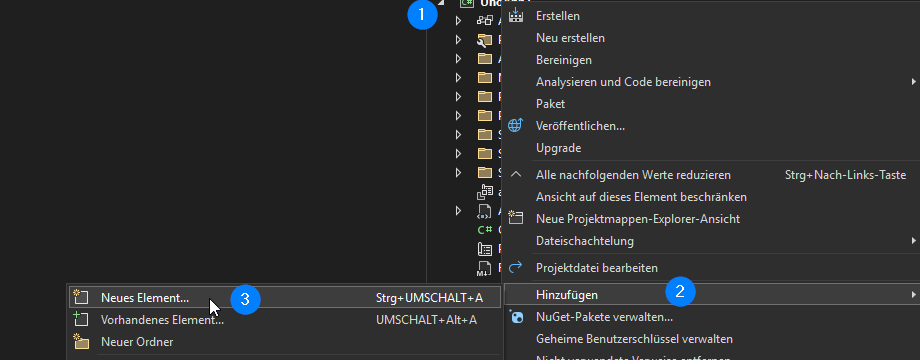

# Anleitung: Aus Klassen ein ViewModel oder Model erstellen

In dieser Anleitung wollen wir uns einmal anschauen, wie man in Visual Studio ein neues Klassen-Element erstellen kann und anschließend entweder ein ViewModel oder ein Model für die Verwendung in einer Uno Platform Anwendung mit **MVUX** erstellen kann.

Für die folgenden Schritte, nehmen wir einmal an, die Seite, zu der das zu erstellende Element gehören soll, heißt **SamplePage.xaml**

1. **Neues Element (für die Verwendung als Model oder ViewModel) hinzufügen:**
   1. Klicke hierzu mit der rechten Maustaste auf den Ordner **Presentation** rechts im Projektmappen-Browser
   2. Wähle **Hinzufügen** aus
   3. Und klicke dann auf **Neues Element**

   

2. **Klassen  Element erstellen:**
   1. Wähle in der Liste das Element **`Class`** aus und benenne diese nach folgendem Schema:

   **Deine Anwendung nutzt:**
   - **Mvvm:** `SampleViewModel.cs`
   - **Mvux:** `SampleModel.cs`

3. Klicke nun noch auf **Hinzufüge**.

   

## [Ein Model erstellen **Mvux**](#tab/create-mvux-model)

Um ein für Mvux passendes Model zu erstellen:

1. Füge vor das aktuelle `class` ein `partial` ein.
2. Ersetze `class` durch `record`
3. Mit dem Snippet Kürzel `ctor` kannst du dir auch direkt automatisch einen (Sekundären-) Konstruktor einfügen lassen.

## [Ein ViewModel erstellen](#tab/create-mvvm-viewmodel)

Um ein für Mvvm passendes ViewModel zu erstellen:

1. Füge vor `class` ein `partial` ein.
2. Füge hinter deinen ViewModel Namen `: ObservableObject` hinzu
3. Mit dem Snippet Kürzel `ctor` kannst du dir auch direkt automatisch einen (Sekundären-) Konstruktor einfügen lassen.

---
