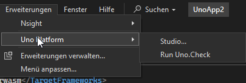

<!--markdownlint-disable MD028 MD041-->
## Anleitung: Entwicklungsumgebung für Uno Platform Apps einrichten

Im folgenden werden wir uns zusammen anschauen, wie man die Entwicklungsumgebung für die Anwendungsentwicklung mit Uno Platform kinderleicht einrichten kann, beziehungsweise das Command Line Interface (**CLI**) Tool `dotnet tool uno-check` diese Routineaufgabe für uns erledigen lassen kann.

> [!TIP]
> Seit dem v6 Release von Uno (SDK & Extension) ist dieses von vorne herein auch in der Visual Studio Uno Platform Extension inkludiert!

> [!TIP]
> Solltest du bei der Ausführung des Tools Probleme haben, kannst du hier den zugehörigen [Offiziellen Guide zu Uno-Check von Uno Platform](https://platform.uno/docs/articles/external/uno.check/doc/using-uno-check.html) finden.

### 📺 Videoanleitung


> [!NOTE]
> Die aktuellste Anleitung für deinen Start mit Uno Platform findest du immer im offiziellen [Quick Start Guide](https://platform.uno/docs/articles/get-started.html).

---

### Schritt für Schritt Anleitung zur Einrichtung

1. **Wähle und installiere deine bevorzugte IDE**

    > [!NOTE]
    > In diesem Guide wird Visual Studio 2022 Community Edition verwendet. Solltest du mit Rider oder Visual Studio Code arbeiten, informiere dich bitte im zuvor verlinkten Quick Start Guide über etwaige Abweichungen!

    [Offizielle Installationsseite für Visual Studio - auch VS Code](https://visualstudio.microsoft.com)

    **IDE**: Integrierte Entwicklungs-Umgebung

1. **Installiere die Uno Platform-Erweiterung**

   Erhältlich im [Visual Studio Marketplace](https://marketplace.visualstudio.com/items?itemName=nventive.unoplatform)

1. **Installiere `Uno.Check` über die Kommandozeile**

   ```bash
   dotnet tool install -g Uno.Check
   ```

1. **Starte `Uno.Check`, um deine Umgebung zu prüfen**

   Entweder via des zuvor schon genutzten Terminals:

   ```bash
   uno-check check
   ```

   Oder wie zuvor schon erwähnt, können wir seit der 6. Version der Visual Studio Extension von Uno Platform `Uno.Check` bereits automatisch dort in unserer IDE verwenden. Also immer wenn wir unsere Projektmappe öffnen, läuft es automatisch durch, bzw. können wir es auch in dem Extensions Drop-Down Menü in Visual Studio > Uno Platform > `Run Uno.Check` auch manuell anstoßen. Es schaut dann nach, welche Endgeräte wir in unserer Projektdatei spezifiziert haben und prüft alle entsprechend benötigten Installationen auf Existenz, aber auch ob wir mit den neusten verfügbaren Versionen arbeiten. Das ist besonders dann hilfreich, wenn Fehlerbehebungen stattgefunden haben und natürlich auch wenn es ein neues Major-Release gab.

   

### Optionen zur Konfiguration von Uno Check

Wenn du nur für bestimmte `Targets`, also Endgeräte deine Anwendungen entwickeln möchtest und dem entsprechend auch nicht alle anderen Workloads benötigst, also bspw. für das [XamlNavigation Tutorial](./Navigation/Extensions-Navigation-de.md)

> [!TIP]
> Um eine übersicht über die verfügbaren Befehle, Konfigurationen und optionale zugehörige Parameter kannst du erhalten, indem du `uno-check -h` im Terminal eingibst.

> [!NOTE]
> Weitere Infos zu den Konfigurationsmöglichkeiten, kannst du in der [Uno.Check Dokumentation](https://platform.uno/docs/articles/external/uno.check/doc/configuring-uno-check.html) finden!

### **Probleme bei der Einrichtung?**

Sieh dir den [Troubleshooting Guide](https://platform.uno/docs/articles/external/uno.check/doc/troubleshooting-uno-check.html) an.

---

### Nächste Schritte

Sobald deine Umgebung eingerichtet ist, kannst du beispielsweise mit dem [Counter Workshop](https://platform.uno/docs/articles/getting-started/counterapp/get-started-counter.html) diese Grundlagen lernen:

- 📁 Die Struktur einer Uno-App
- 🖼️ Den Umgang mit Assets (Bilder/Icons) über **`Uno.Resizetizer`**
- 🔗 Die Verwendung von Commands und Bindings

> [!TIP]
> Abhängig vom Tutorial, das du anschließend machen möchtest, solltest du im Workshop die passende Variante auswählen:
>
> - Wähle zwischen **XAML** oder **C#** als Markup
> - Und zwischen **MVVM** oder **MVUX** als `Presentation` deiner Anwendung.

---
