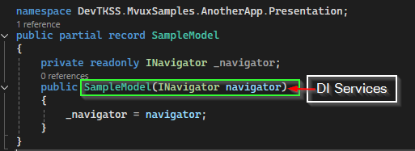
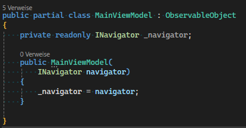
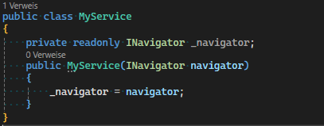

# Anleitung: Nutze Konstruktor Parameter für DependencyInjection

Diese Anleitung baut darauf auf, dass du bereits ein Model, ViewModel oder eine Service Klasse erstellt hast. Solltest du das noch nicht getan haben, ist hier eine [Anleitung um das zu tun](./HowTo-Adding-New-VM-Class.md)

Um **DependencyInjection** in deinem Model oder ViewModel, oder jeglicher Klassen Definition ebenso nutzen möchtest, füge nun in den erstellten Konstruktor die für die Funktionen während der Laufzeit benötigten (*optimalerweise*) Interfaces und/oder Klassen deiner erwarteten Services hinzu:

## [In Mvux](#tab/model-with-di-params)

## [In Mvvm](#tab/viewmodel-with-di-params)

## [Sonstige Klassen oder Services](#tab/classes-with-di-params)

---
