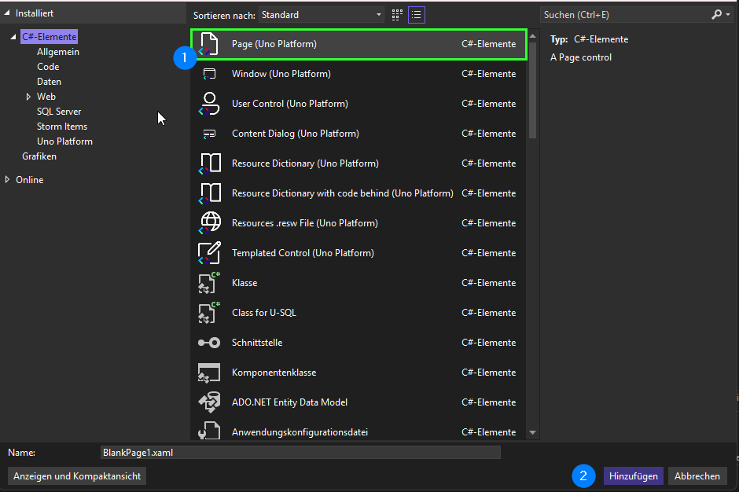

## How To: Add a Page

In this guide, we will add a new page with sample content to our Uno app together.

1. **Add a new item:**
   1. Right-click on the **Presentation** folder in the Solution Explorer on the right
   2. Select **Add**
   3. Then click on **New Item**

   

2. **Create a Page element:**
   1. Select the **`Page (Uno Platform)`** element at the top of the list and give it a name with the Page suffix. For example: `SamplePage.xaml`. This suffix is mandatory for Uno applications.
   2. Now click **Add**.

   

### Adding Sample Content

To see that we are actually on the desired page, we now add simple sample content:

```xml
<Page x:Class="UnoApp2.Presentation.HelloWorldPage"
      xmlns="http://schemas.microsoft.com/winfx/2006/xaml/presentation"
      xmlns:x="http://schemas.microsoft.com/winfx/2006/xaml"
      xmlns:local="using:UnoApp2.Presentation"
      xmlns:d="http://schemas.microsoft.com/expression/blend/2008"
      xmlns:mc="http://schemas.openxmlformats.org/markup-compatibility/2006"
      mc:Ignorable="d"
      Background="{ThemeResource BackgroundBrush}">
    <Grid>
        <TextBlock Text="Hello World"
                    HorizontalTextAlignment="Center"
                    VerticalAlignment="Center" />
    </Grid>
</Page>
```

This way, the text `Hello World` will be displayed on this page. Of course, you are free to use any content you like.

---
