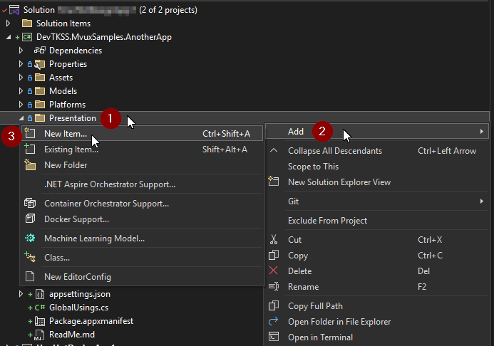
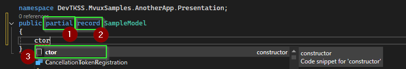
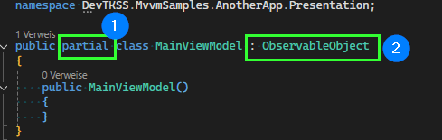

## How To: Create a ViewModel or Model from Classes

In this guide, we will look at how to create a new class element in Visual Studio and then create either a ViewModel or a Model for use in an Uno Platform application with **MVUX**.

For the following steps, let's assume the page that the element to be created belongs to is called **SamplePage.xaml**

1. **Add a new item (for use as Model or ViewModel):**
   1. Right-click on the **Presentation** folder in the Solution Explorer on the right
   2. Select **Add**
   3. Then click on **New Item**

   

2. **Create a Class element:**
   1. Select the **`Class`** element in the list and name it according to the following scheme:

   **Your application uses:**
   - **Mvvm:** `SampleViewModel.cs`
   - **Mvux:** `SampleModel.cs`

3. Now click **Add**.

   

### [Create a Model **Mvux**](#tab/create-mvux-model)

To create a Model suitable for Mvux:

1. Insert `partial` before the current `class`.
2. Replace `class` with `record`
3. With the snippet shortcut `ctor` you can also automatically insert a (secondary) constructor.

### [Create a ViewModel](#tab/create-mvvm-viewmodel)

To create a ViewModel suitable for Mvvm:

1. Insert `partial` before `class`.
2. Add `: ObservableObject` after your ViewModel name
3. With the snippet shortcut `ctor` you can also automatically insert a (secondary) constructor.

---
