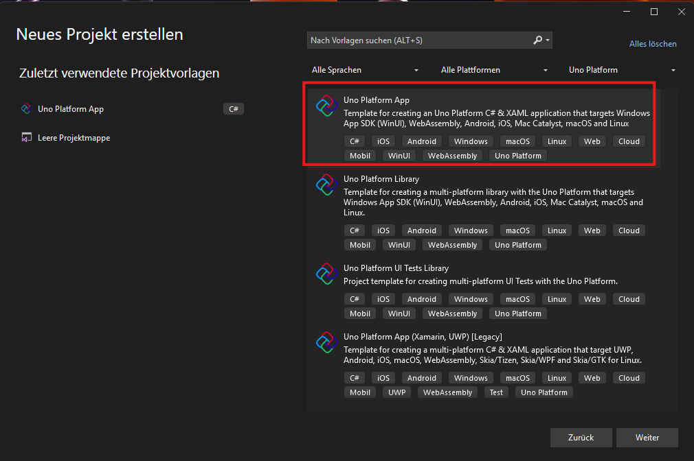
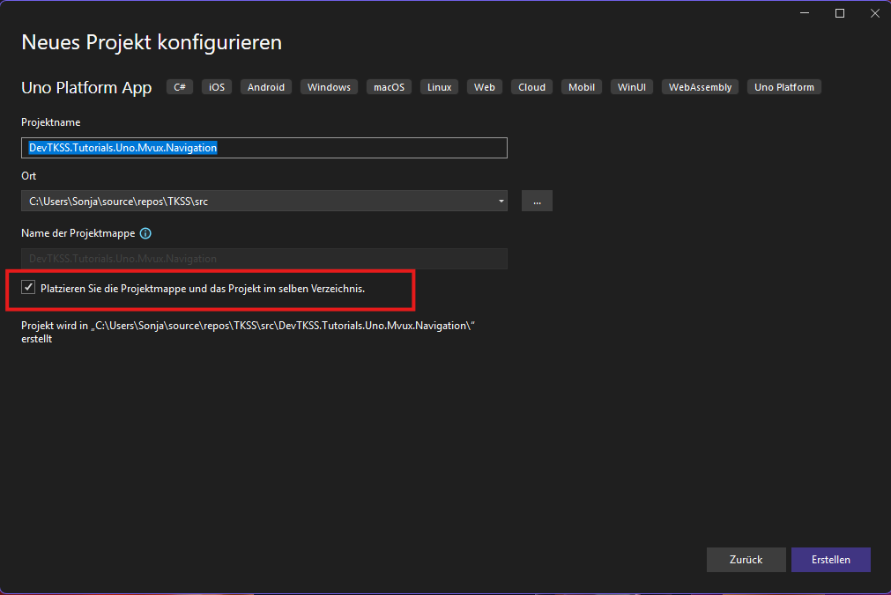
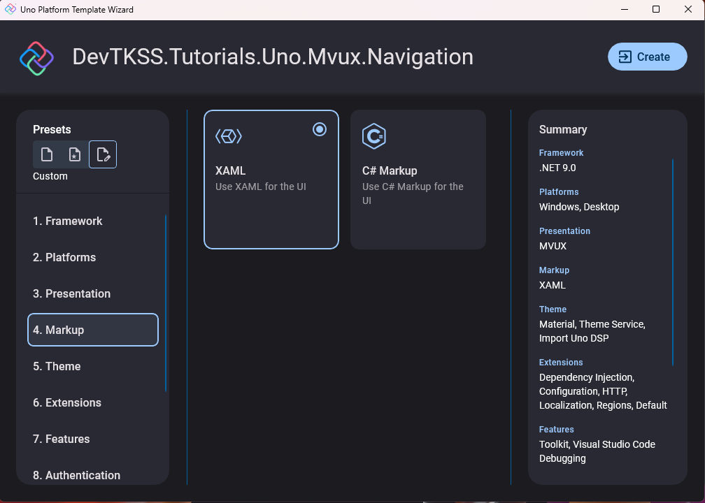
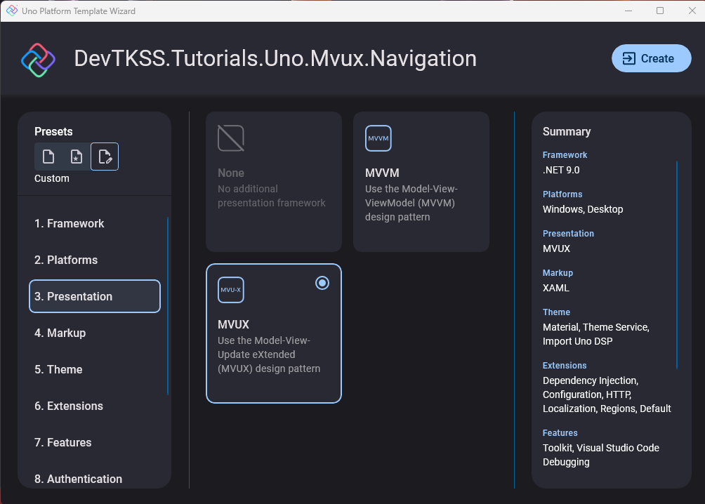
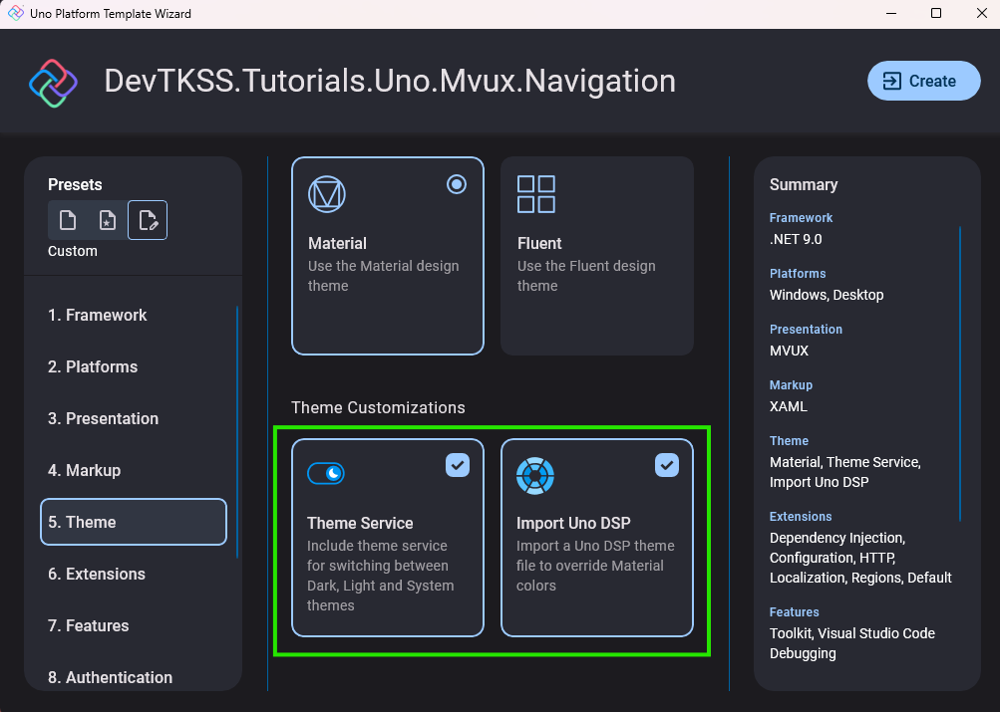
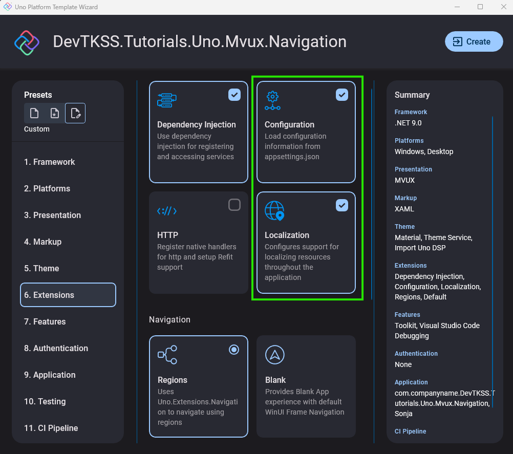
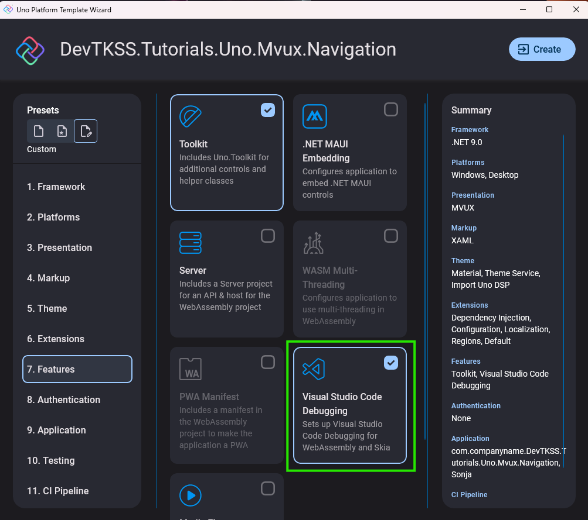

## How To: Create a New Uno Application

In this guide, you will learn how to create an Uno Platform application using the Wizard or dotnet CLI to follow, for example, the [Xaml Navigation App Tutorial](./Navigation/Extensions-Navigation-en.md).

To follow along, you should have previously completed the [Development Environment Setup Guide](xref:DevTKSS.Uno.Setup.DevelopmentEnvironment.en).

## Video Tutorial on Configuration

> [!NOTE]
> This video is currently only available in German, but transcriptions have been added to the video description, which should be usable through YouTube's auto-translate feature. You can also enable auto-translated subtitles in YouTube to follow along in your preferred language.


## Create and Configure an Uno App via Template

In the following, you will learn how to configure an Uno app by selecting the desired options. You can either use the Visual Studio Wizard or the dotnet CLI tool. For the latter, it is recommended to visit the [Web Wizard](https://new.platform.uno/) to make configuration easier and get the appropriate `dotnet new` command!

### [Visual Studio 2022](#tab/vs-wizard)

#### Select Template

1. Open Visual Studio 2022 and select **"Create a new project"** in the start window.
2. Search for the template **"Uno App"** and select it. Click **"Next"**.

   

3. Give your project a name and enable the option **"Place solution and project in the same directory"**. Then click **"Create"**.

   

#### The Template Wizard

**Select the following options in the Visual Studio Wizard to configure your app:** *(using the Xaml Navigation App Tutorial as an example)*

1. Use the preset **`recommended`**
2. Target Framework: **`net9.0`**

3. As `Platform` select at least **Desktop** or **Skia Desktop**.

4. Markup: **`Xaml`**

   

5. Presentation: **`MVUX`**

   

6. Select the **Material Design Theme** under **Themes**.

    

    > [!TIP]
    > By default, **ThemeService** is also selected, which would allow you to switch between light and dark UI later. It is not directly required here, but you can leave it in if you like.

7. Extensions: **`Regions`**, **`DependencyInjection`**

   

8. *(Optional)* select the **Uno Toolkit**.

    

    > [!TIP]
    > If you want to keep the option open to develop in Visual Studio Code later, you should also select `Visual Studio Code Debugging` here.

9. Finally, click **`Create`** to generate the app.

### [The dotnet CLI Tool](#tab/dotnet-cli)

1. Optionally open the [Uno Platform Web Wizard](https://new.platform.uno/) in your browser to make configuration easier and get the appropriate `dotnet new` command. Alternatively, you can always view all possible options via `dotnet new unoapp --help` in the terminal!
2. Open a terminal and navigate to the desired directory.
3. With the following command, you get the minimum configuration to create a new app for the [**Xaml Navigation App Tutorial**](./Navigation/Extensions-Navigation-en.md):

   ```bash
   dotnet new unoapp -o XamlNavigationApp -preset "recommended" -platforms "desktop" -config False -http "none" -loc False -dsp False -theme-service False
   ```

   Alternatively, if you want to use all the options shown in the video, you can use the following command:

   ```bash
   dotnet new unoapp -o XamlNavigationApp -preset "recommended" -platforms "desktop" -http "none"
   ```

---
