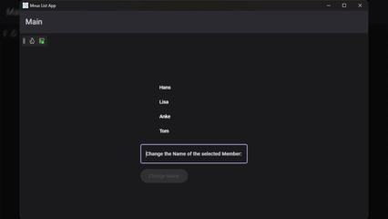

# Anleitung: Aktualisierung von ListState Items

## Überblick

In diesem Tutorial erweitern wir das vorherige Beispiel und fügen die Möglichkeit hinzu, Elemente in einem `ListState` zu bearbeiten. Du wirst lernen:

- Wie du einen zusätzlichen State für Benutzereingaben erstellst
- Wie du `UpdateAllAsync(...)` verwendest, um Elemente zu aktualisieren
- Wie du `[FeedParameter]` für saubereres State-Handling nutzt
- Warum wir `IListState<T>` anstelle von `IListFeed<T>` für Aktualisierungen benötigen

Dieses Szenario zeigt, warum wir `ListState` anstelle von `ListFeed` benötigen: Während `ListFeed` nur `RequestRefresh` oder `Refresh` Aktionen unterstützt (die einen neuen API-/Service-Aufruf erfordern), ermöglicht `ListState` die direkte Aktualisierung von Elementen in der Liste mithilfe von Filterkriterien.

## Voraussetzungen

Bevor du mit diesem Tutorial beginnst, stelle sicher, dass du:

- [Anleitung: Binding von ListState mit Selection](xref:DevTKSS.Uno.MvuxStateManagement.ListState.Selection.de) erfolgreich abgeschlossen hast

## Visuelle Referenz



## Erweiterung des Models

Wir erweitern unser bestehendes Model um einen zusätzlichen State für die Bearbeitung und eine Methode zum Aktualisieren:

### Zusätzlicher State für die Bearbeitung

Wir benötigen einen State, um den geänderten Mitgliedernamen zu halten, den du eingibst:

```csharp
public IState<string> ModifiedMemberName => State<string>.Empty(this);
```

Dieser State ist bidirektional an die `TextBox` gebunden und erfasst deine Eingabe.

### Vollständiges Model

So sieht dein vollständiges Model aus:

```csharp
public partial record MainModel
{
    public IListState<string> Members => ListState<string>.Value(this,
         () => ImmutableList.Create(
            [
                "Hans",
                "Lisa",
                "Anke",
                "Tom"
            ])
        ).Selection(SelectedMember);

    public IState<string> SelectedMember => State<string>.Value(this, () => string.Empty);
    
    public IState<string> ModifiedMemberName => State<string>.Empty(this);
}
```

## Erweiterte View (XAML)

Jetzt fügen wir die Bearbeitungselemente zur UI hinzu:

[!code-xaml[](../../../../src/DevTKSS.Uno.MvuxListApp/Presentation/MainPage.xaml#MembersView?highlight=18,23,27,30)]

Die neuen Bindings:

- `Text="{Binding Path=ModifiedMemberName, Mode=TwoWay}"` - bidirektionales Binding für die Bearbeitung
- `Command="{Binding Path=RenameMemberAsync}"` - löst die Umbenennungsoperation aus

## Implementierung des Rename-Befehls

> [!NOTE]
> Wir verwenden einen schaltflächengesteuerten Befehl anstelle eines `.ForEach(...)`-Callbacks, um dir die explizite Kontrolle darüber zu geben, wann die Umbenennung erfolgt. Dies verhindert unbeabsichtigte Änderungen, wenn du:
>
> - Das falsche Mitglied ausgewählt hast
> - Noch die korrekte Schreibweise nachschlägst
> - Deine Meinung über die Umbenennung änderst

Hier ist die Befehlsimplementierung:

```csharp
public async ValueTask RenameMemberAsync(
    [FeedParameter(nameof(ModifiedMemberName))] string? modName,
    [FeedParameter(nameof(SelectedMember))] string? replaceMember,
    CancellationToken ct)
{
    if (string.IsNullOrWhiteSpace(modName))
        return;

    await Members.UpdateAllAsync(
        match: item => item == replaceMember,
        updater: _ => modName,
        ct: ct
    );

    await Members.TrySelectAsync(modName, ct);
}
```

Wichtige Punkte:

- **`UpdateAllAsync(...)`** - Aktualisiert Elemente im `ListState`, die den Filterkriterien entsprechen
- **`match: item => item == replaceMember`** - Findet das aktuell ausgewählte Mitglied
- **`updater: _ => modName`** - Ersetzt es durch den neuen Namen
- **`TrySelectAsync(...)`** - Wählt das Mitglied erneut anhand seines neuen Namens aus

## Verwendung des FeedParameter-Attributs

Beachte die `[FeedParameter]`-Attribute auf den Methodenparametern. Diese leistungsstarke Funktion wartet automatisch auf State-Werte und bindet sie an deine Methodenparameter, wodurch manuelle `await`-Aufrufe eliminiert werden:

```csharp
[FeedParameter(nameof(ModifiedMemberName))] string? modName,
[FeedParameter(nameof(SelectedMember))] string? replaceMember
```

> [!TIP]
> **Vorteile:**
>
> - Kein manuelles `await` der States innerhalb der Methode erforderlich
> - Parameter können andere Namen als die ursprünglichen States haben (verbessert die Lesbarkeit)
> - Sauberere, fokussiertere Methodenimplementierung

**Alternative:** Verwende `[ImplicitFeedParameter]` auf Klassenebene, um alle Parameter automatisch zu binden, indem Namen exakt mit deinen States übereinstimmen:

```csharp
[ImplicitFeedParameter]
public partial record MainModel
{
    ...

    public async ValueTask RenameMemberAsync(
        string? ModifiedMemberName,
        string? SelectedMember,
        CancellationToken ct)
    { ... }
}
```

Mit `[ImplicitFeedParameter]` auf der Klasse werden alle Methodenparameter automatisch gebunden, indem ihre Namen exakt mit deinen State-Property-Namen übereinstimmen. Das bedeutet:

- Der Parameter `ModifiedMemberName` bindet automatisch an den `ModifiedMemberName`-State
- Der Parameter `SelectedMember` bindet automatisch an den `SelectedMember`-State
- Keine individuellen `[FeedParameter]`-Attribute für jeden Parameter erforderlich
- Parameternamen müssen exakt mit State-Namen übereinstimmen (Groß-/Kleinschreibung beachten)

## Zusammenfassung

Dieses Beispiel demonstriert:

1. Verwendung von bidirektionalem Binding für Benutzereingaben über `IState<string>`
2. Aktualisierung von Listenelementen mit `UpdateAllAsync(...)` - nur verfügbar bei `IListState<T>` (nicht `IListFeed<T>`)
3. Befehlsbasierte Aktualisierungen für explizite Benutzerkontrolle
4. Nutzung von `[FeedParameter]` für saubereres asynchrones State-Handling

Dieses Muster gewährleistet Datenkonsistenz und gibt dir die volle Kontrolle darüber, wann Änderungen in den Daten erfolgen und wann auch nicht.
