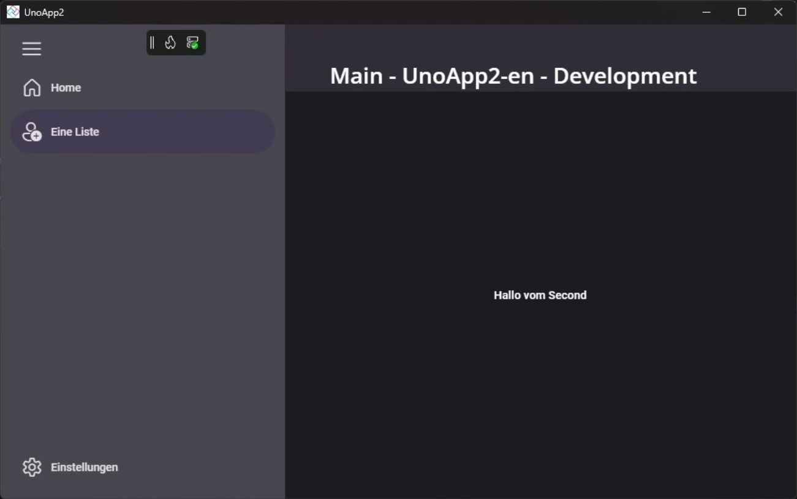

# Tutorial: Navigation mit Uno Extensions



## Inhalt dieses Tutorials

- Ein `NavigationView`-Steuerelement zur Navigation.
- Routen, die in der Datei `App.xaml` definiert sind.
- Eine `MainPage.xaml`, die als Einstiegspunkt für die Navigation dient.
- `DashboardPage` und `SecondPage` als Beispielseiten für die Navigation.
- Jede Seite bindet an einen `IState<string>`-Eigenschaft im zugehörigen Model, um die Zustandsverwaltung gemäß MVUX zu demonstrieren.

Da diese Beispiel-App im Rahmen eines Community-Tutorial-Videos auf YouTube erstellt wurde, kannst du dem Video folgen und den Aufbau der App Schritt für Schritt nachvollziehen. Dort sind auch Transkripte hinzugefügt, da es in Deutscher Sprache aufgenommen wurde.

- [Zur Playlist auf YouTube](https://youtube.com/playlist?list=PLEL6kb4Bivm_g81iKBl-f0eYPNr5h2dFX&si=qHkpAUMSW9s8GZCO)

## Vorstellung der Möglichkeiten

Lass uns zuerst einmal schauen, was man beispielsweise in einer Xaml-basierten Uno Anwendung damit erstellen kann, am beispiel der MvuxGallery.


---

## Voraussetzungen

Diese Tutorial Reihe baut darauf auf, dass deine Entwicklungsumgebung bereits vollständig eingerichtet ist und der nachfolgende Befehl dir  in deinem Terminal ausgeführt grünes Licht gibt:

```bash
uno-check --tfm net9.0-desktop`
```

Hier kannst du bei Bedarf auch noch einmal nachschauen:

- [Tutorial: Einrichten der Entwicklungsumgebung](xref:DevTKSS.Uno.Setup.DevelopmentEnvironment.de)

## Nächste Schritte

In den nächsten Schritten findest du Anleitungen, mit welchen du lernen kannst, wie man in einer Uno Platform Anwendung eine Navigation mithilfe des Uno Feature `Navigation`, also des `Uno.Extensions.Navigation` NuGet implementieren kann. Hierfür kannst du einfach die Fußleisten Navigation verwenden, um die einzelnen Schritte zu durchlaufen.

**Ich starte mit...**

[**Einer neuen Uno Platform App**](xref:DevTKSS.Uno.Setup.HowTo-CreateNewUnoApp.de) | [**Einer bestehenden Uno Platform App**](xref:DevTKSS.Uno.ExtensionsNavigation.UpgradeExistingApp.de)

Wenn du diesen Schritt abgeschlossen hast, fahren wir mit der Implementierung der Navigation mittels des `NavigationView` Steuerelements fort.

[**Implementierung der Navigation via NavigationView**](xref:DevTKSS.Uno.ExtensionsNavigation.HowTo-Defining-UI.de)

---

- [Hier geht's zum Source Code der verwendeten Beispiel Anwendung XamlNavigationApp](https://github.com/DevTKSS/DevTKSS.Uno.SampleApps/blob/master/src/DevTKSS.Uno.XamlNavigationApp)

### Uno Dokumentation Links

- [How-To: Navigate in Xaml](https://platform.uno/docs/articles/external/uno.extensions/doc/Learn/Navigation/HowTo-NavigateInXAML.html)
- [How-To: Define Routes](https://platform.uno/docs/articles/external/uno.extensions/doc/Learn/Navigation/HowTo-DefineRoutes.html)
- [How-To: Regions](https://platform.uno/docs/articles/external/uno.extensions/doc/Learn/Navigation/HowTo-Regions.html)
- [How-To: Use NavigationView to Switch Views](https://platform.uno/docs/articles/external/uno.extensions/doc/Learn/Navigation/Advanced/HowTo-UseNavigationView.html)
- [How-To: IRouteNotifier](https://platform.uno/docs/articles/external/uno.extensions/doc/Learn/Navigation/Advanced/HowTo-IRouteNotifier.html)
